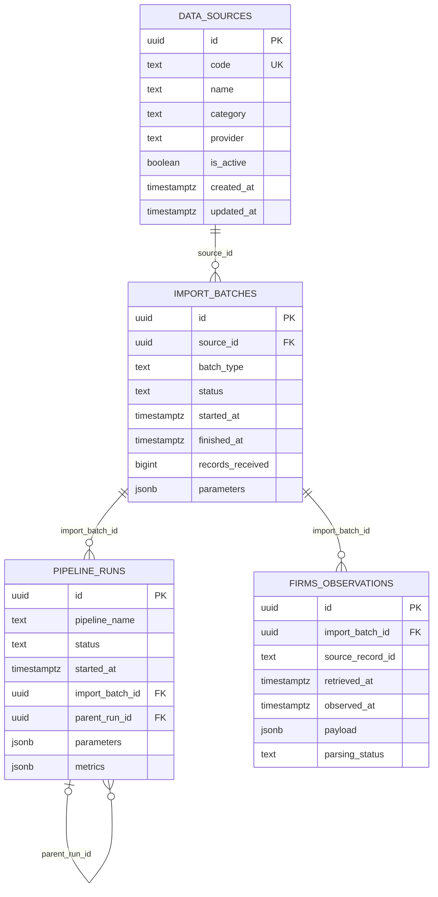

# ERYTHEON — Rapport de phase 1

Date de validation : 26 juillet 2026  
Périmètre : fondation additive de la plateforme de données  
Statut production : **non appliquée**

## 1. Résultat

La migration SQLx `0009_data_platform_foundation.sql` crée :

- 12 schémas spécialisés : `raw`, `staging`, `reference`, `environment`, `human`, `fire`, `features`, `risk`, `validation`, `ml`, `serving`, `ops` ;
- `reference.data_sources` ;
- `ops.import_batches` ;
- `ops.pipeline_runs` ;
- `raw.firms_observations`.

Elle ne modifie aucune table applicative existante, ne déplace aucune donnée et n'ajoute ni trigger, ni permission, ni extension PostgreSQL.

Les UUID sont générés par l'application. Aucune extension supplémentaire n'est donc nécessaire. Les extensions déjà restaurées, dont PostGIS, restent inchangées.

## 2. Fichiers

- `migrations/0009_data_platform_foundation.sql` : contenu SQL complet et officiel de la migration.
- `migrations/rollback/0009_data_platform_foundation.down.sql` : contenu SQL complet et officiel du rollback.
- `crates/store/tests/platform_foundation.rs` : tests SQLx et tests de compatibilité applicative.
- `PHASE1_DATA_PLATFORM_FOUNDATION_REPORT.md` : présent rapport.

## 3. Schéma logique



`ops.pipeline_steps` n'est pas créée : aucune orchestration par étapes ne l'utilise actuellement. L'ajouter maintenant augmenterait la surface du modèle sans valeur immédiate.

Pour NASA FIRMS, l'approche spécialisée `raw.firms_observations` est retenue. Le volume et le seul pipeline pilote ne justifient pas encore une table générique de réponses complètes. Chaque ligne brute reste traçable vers son batch et le commentaire SQL formalise son caractère append-only.

## 4. Choix de types

- `UUID` : identifiants techniques générables par plusieurs processus sans séquence partagée.
- `TIMESTAMPTZ` : instants non ambigus, interprétés en UTC par la plateforme.
- `BIGINT` : compteurs d'import capables de dépasser la plage 32 bits ; compatible avec les futurs index H3 lorsqu'ils seront introduits.
- `TEXT` + `CHECK` : statuts et catégories évolutifs sans enum PostgreSQL rigide.
- `JSONB` : uniquement payload brut, paramètres et métriques variables ; aucun index GIN sans requête concrète.
- `BOOLEAN` : activation d'une source sans suppression de sa définition.

## 5. Contraintes

- clés primaires UUID sur les quatre tables ;
- unicité et format applicatif stable de `reference.data_sources.code` ;
- catégories et statuts limités aux valeurs explicitement supportées ;
- noms, fournisseurs, types de batch, pipelines et déclencheurs non vides ;
- compteurs d'import non négatifs ;
- `finished_at >= started_at` lorsque la fin existe ;
- intervalle demandé cohérent ;
- paramètres et métriques obligatoirement des objets JSON ;
- suppressions référentielles en `RESTRICT` pour préserver la traçabilité ;
- parent de run différent du run lui-même ;
- payload FIRMS obligatoirement un objet JSON.

Les contraintes restent volontairement simples : elles autorisent les runs en cours sans date de fin et n'imposent pas de règles fragiles entre statut et compteurs.

## 6. Index

- `ops.import_batches(source_id, started_at DESC)` : historique récent d'une source.
- `ops.import_batches(status)` : recherche des imports actifs ou en erreur.
- `ops.import_batches(started_at DESC)` : supervision chronologique globale.
- `ops.pipeline_runs(pipeline_name, started_at DESC)` : historique d'un pipeline.
- `ops.pipeline_runs(status)` : supervision des runs actifs ou échoués.
- `ops.pipeline_runs(started_at DESC)` : supervision chronologique globale.
- index partiels sur `import_batch_id` et `parent_run_id` : navigation de filiation sans indexer les valeurs nulles.
- `raw.firms_observations(import_batch_id)` : lecture des lignes d'un batch.
- index partiel sur `observed_at DESC` : recherches temporelles futures, uniquement lorsque l'instant source existe.

Aucun JSONB n'est indexé.

## 7. Environnement isolé

Source :

- dump validé : `/opt/pyrorisk/backups/pyrorisk-20260725T223712Z.dump` ;
- taille : `1 653 743 685` octets ;
- SHA-256 : `c9538b7d5de82b8cd428f548896affc294fe17a58f1810535c207dd60e4dd217`.

Nouvelle copie dédiée :

- conteneur : `erytheon-phase1-test-20260725t223712z` ;
- volume : `erytheon-phase1-test-20260725t223712z-data` ;
- base : `pyrorisk_phase1_test` ;
- port : lié uniquement à `127.0.0.1:55433` sur le VPS ;
- artefacts : `/opt/pyrorisk/phase1-tests/20260725t223712z`.

La restauration témoin de phase 0 `erytheon-restore-test-20260725t223712z-v3` n'a pas été modifiée. Aucun ancien conteneur ou volume n'a été supprimé.

Un premier lancement de restauration a été interrompu par l'arrêt normal du serveur temporaire utilisé par l'initialisation PostGIS. La base partielle a été supprimée sur cette copie uniquement, puis recréée après détection de `PostgreSQL init process complete`. La seconde restauration a réussi. Ce problème ne concernait ni le dump, ni la migration, ni la production.

## 8. Tests

### Tests ciblés

- compilation du test SQLx : réussite ;
- `cargo fmt --all -- --check` : réussite ;
- `cargo clippy -p store --test platform_foundation -- -D warnings` : réussite ;
- test SQLx sur la copie restaurée : `1 passed, 0 failed` ;
- application initiale de `0009` par `Store::connect`/SQLx : réussite ;
- contrôle des 12 schémas, 4 tables, types, 4 PK, 4 FK et unicité : réussite ;
- insertions source, batch, run lié et ligne FIRMS : réussite ;
- six statuts acceptés : réussite ;
- compteur négatif, date inversée et statut inconnu refusés : réussite ;
- rollback transactionnel après erreur : réussite ;
- `Store::health_check()` et lecture de `source_statuses()` existants : réussite.

### Suites plus larges

- `cargo test -p api --lib` : 2 tests réussis, 0 échec ;
- suite workspace tentée : le test API d'intégration refuse une `DATABASE_URL` volontairement vide (`RelativeUrlWithoutBase`) ;
- suite workspace sans le crate API tentée : 18 tests moteur réussis et 3 tests d'intégration ont expiré en attendant leur base locale (`PoolTimedOut`) ;
- ces échecs de configuration surviennent avant leurs assertions métier et ne sont pas causés par `0009` ;
- le test ciblé, exécuté avec la copie PostgreSQL restaurée réelle, réussit après le refactoring final.

### Rollback et réapplication

- les tests ne laissent aucune ligne dans les nouvelles tables ;
- rollback tenté avec une ligne de test : refus attendu avec `rollback refused: reference.data_sources contains data` ;
- suppression de cette seule ligne de test sur la copie ;
- rollback vide : réussite, 0 schéma de fondation restant ;
- suppression de l'enregistrement `0009` dans `_sqlx_migrations` sur la copie uniquement, nécessaire pour simuler une réapplication SQLx ;
- réapplication de `0009` : réussite ;
- nouveau passage du test SQLx : réussite.

## 9. Preuve que `public` est inchangé

État initial : 13 tables `public`, 8 migrations SQLx historiques.

Après application et après réapplication :

- différence du dump `public` schema-only : **0 ligne** ;
- différence de la liste des tables `public` : **0 ligne** ;
- différence des extensions : **0 ligne** ;
- différence des 8 migrations historiques : **0 ligne** ;
- empreinte initiale du schéma `public` : `3c685afd40f4b6069b2ab710b6122523771d774343e67eb14c8e75d1fc4f8cd0` ;
- seule addition dans `public` : la ligne officielle `9 | data platform foundation | true` de `_sqlx_migrations`, exigée par SQLx.

Aucune donnée métier existante n'a été modifiée. Les écritures des tests dans les nouveaux schémas ont toutes été annulées ou supprimées sur la copie isolée.

## 10. Application future en production

Cette procédure est documentée mais **n'a pas été exécutée**.

1. Refaire une sauvegarde complète datée et vérifier son SHA-256 et `pg_restore --list`.
2. Vérifier que le code déployé contient exactement `migrations/0009_data_platform_foundation.sql`.
3. Capturer les tables, extensions et le schéma-only de `public`.
4. Démarrer une seule instance du binaire contenant `0009`, ou exécuter une commande dédiée utilisant le même migrateur SQLx et la même `DATABASE_URL`.
5. Vérifier dans `_sqlx_migrations` que la version 9 est présente avec `success = true`.
6. Exécuter les requêtes de vérification de la section suivante.
7. Comparer à nouveau `public` à l'état initial.

Ne pas démarrer plusieurs instances applicatives simultanément pendant cette opération, même si SQLx sérialise normalement ses migrations.

## 11. Vérification future

```sql
SELECT version, description, success
FROM public._sqlx_migrations
WHERE version = 9;

SELECT schema_name
FROM information_schema.schemata
WHERE schema_name IN (
  'raw', 'staging', 'reference', 'environment', 'human', 'fire',
  'features', 'risk', 'validation', 'ml', 'serving', 'ops'
)
ORDER BY schema_name;

SELECT table_schema, table_name
FROM information_schema.tables
WHERE (table_schema, table_name) IN (
  ('reference', 'data_sources'),
  ('ops', 'import_batches'),
  ('ops', 'pipeline_runs'),
  ('raw', 'firms_observations')
)
ORDER BY table_schema, table_name;
```

Puis exécuter le test ciblé avec une URL de base fournie de manière secrète :

```sh
cargo test -p store --test platform_foundation
```

## 12. Rollback futur

Le rollback ne doit être envisagé qu'avant toute utilisation des nouvelles tables :

1. arrêter le déploiement de la phase 1 ;
2. vérifier explicitement que les quatre nouvelles tables sont vides ;
3. sauvegarder la base ;
4. exécuter `migrations/rollback/0009_data_platform_foundation.down.sql` avec arrêt sur première erreur ;
5. vérifier l'absence des 12 schémas ;
6. retirer la version 9 de `_sqlx_migrations` uniquement si l'équipe décide officiellement de revenir à l'état antérieur et comprend que SQLx ne gère pas nativement les down migrations ;
7. redémarrer l'application précédente et vérifier `/health`.

Le script refuse de continuer dès qu'une nouvelle table contient une ligne. S'il refuse, aucune suppression ne doit être forcée : il faut concevoir un plan de conservation ou de migration des données.

## 13. Avertissements et décisions

- La production n'a reçu ni migration, ni nouveau binaire.
- Aucun rôle et aucune permission PostgreSQL n'ont été modifiés.
- Aucun secret n'est inclus dans ce rapport ou dans les sorties conservées.
- La suite workspace complète ne peut pas être déclarée verte sans fournir l'environnement PostgreSQL local attendu par trois anciens tests d'intégration.
- `raw` est documenté append-only mais n'est pas verrouillé par trigger ou permission, conformément au périmètre.
- Les timestamps utilisent `TIMESTAMPTZ`; la discipline UTC reste à imposer dans les futurs producteurs.
- `ops.pipeline_steps` reste différé.
- Une table générique `raw.source_responses` reste différée jusqu'à l'arrivée d'un besoin multi-source concret.
- La phase 2 n'a pas commencé.

Décision requise : validation explicite de ce rapport avant toute application de `0009` en production.
