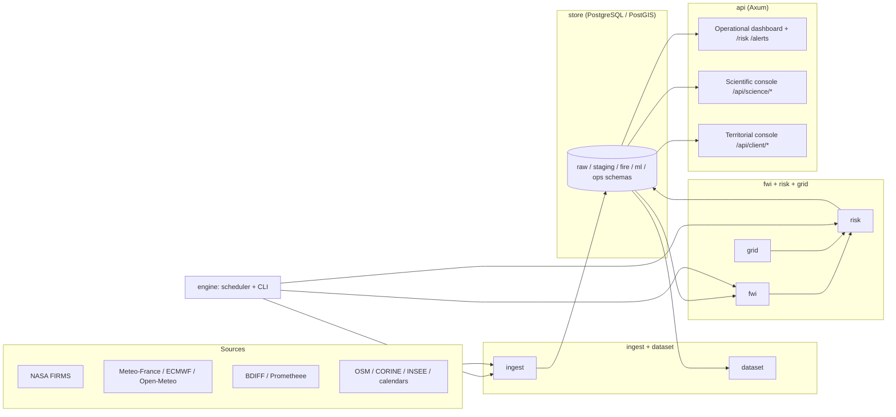

# Architecture

FireSift is a single Rust Cargo workspace of nine crates, one PostgreSQL/
PostGIS database, and one HTTP API surface with three parts: an
operational dashboard, a read-only scientific console, and a read-only
territorial (municipality-scoped) view.

## Crates

| Crate | Responsibility |
|---|---|
| `engine` | Configuration, CLI commands, scheduler, orchestration, binary entry point |
| `api` | Axum HTTP/WebSocket API — operational dashboard, scientific console, territorial console |
| `store` | PostgreSQL/PostGIS access, migrations, repositories |
| `ingest` | Source connectors and normalization (FIRMS, Météo-France, ECMWF, Open-Meteo, BDIFF, Prométhée, OSM, CORINE, INSEE, calendars) |
| `dataset` | Scientific dataset construction and versioning |
| `quality` | Data-quality audits and validation rules |
| `risk` | Operational (v1) scoring and explainable fusion |
| `fwi` | Canadian Fire Weather Index computation |
| `grid` | H3 grid, bounding boxes, geographic conversions |

## Storage

PostgreSQL/PostGIS separates raw ingested data, staging, fire event
records, validation and quality tables, ML dataset/model registries, and
operational tables. Migrations under [`migrations/`](../migrations) are
additive SQLx migrations applied by the `engine` binary at startup;
historical migrations are treated as immutable once applied (see
[`CONTRIBUTING.md`](../CONTRIBUTING.md)).

## API surfaces

- **Operational** (`/`, `/health`, `/risk`, `/risk/cell/{h3}`, `/alerts`,
  `/sources`, `/stream`) — the dashboard and the risk surfaces described in
  [`docs/api.md`](api.md).
- **Scientific console** (`/science`, `/api/science/*`) — read-only,
  gated behind `SCIENCE_CONSOLE_ENABLED` (default `false`); every route is
  `GET`. See [`docs/research/reports/SCIENTIFIC_CONSOLE_ARCHITECTURE.md`](research/reports/SCIENTIFIC_CONSOLE_ARCHITECTURE.md).
- **Territorial console** (`/client`, `/api/client/*`) — a read-only,
  single-commune-scoped view resolved generically by INSEE code (no
  commune hard-coded). Internally this began as a "client console"
  concept for municipal stakeholders; it is a technically useful
  read-only geographic view and is kept, but should be described publicly
  as a **scoped territorial dashboard**, not a commercial client portal —
  the project no longer positions FireSift as a paid product (see the root
  [`README.md`](../README.md) for the current positioning).

All three surfaces are served by the same `api` crate and the same `engine`
binary; there is no separate write-capable admin surface.

## Deployment shape

FireSift runs as a single container (see [`Dockerfile`](../Dockerfile))
against a private PostgreSQL/PostGIS instance, with a reverse proxy
(Caddy) as the only public entry point. See
[`docs/deployment.md`](deployment.md) for a generic deployment guide.
