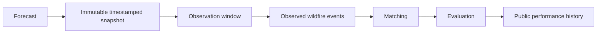

# Public platform — vision document

This is a **design sketch for future work**, not a description of anything
currently implemented or committed to. Nothing here should be read as a
promise or a timeline; it exists so that contributors thinking about the
public web platform (Phase C/D in [`ROADMAP.md`](../ROADMAP.md)) share a
starting point instead of each inventing one.

## What a future public site could show

- A map of the covered territory (metropolitan France, or the active AOI)
  with H3 risk surfaces.
- Forecast horizons: `nowcast`, `+6h`, `+24h`, `+48h`.
- The Fire Weather Index and its sub-components.
- The main contributing risk factors per cell (see "cell explanation"
  below).
- Recent FIRMS thermal anomalies as context, clearly labeled as
  observations, not predictions.
- Underlying weather data and its source.
- Timestamp of the last computation, and a visible staleness indicator if
  a source is degraded (see [`docs/scientific-limitations.md`](scientific-limitations.md#coverage-and-freshness-depend-on-upstream-sources)).
- Which model version produced the score (`human-v1` today; never a
  candidate that hasn't been promoted).

### Cell explanation (sketch)

A single H3 cell's detail view could show, in the spirit of the existing
`/risk/cell/{h3}` operational endpoint:

```text
Risk level
FWI
Human ignition propensity
WUI
Historical ignition signal
Road proximity
Weather source
Model version
Computation timestamp
```

## Disclaimer (required wherever risk output is shown)

> FireSift is an experimental research project. Its outputs are not
> official wildfire warnings, emergency alerts, or guarantees that a fire
> will or will not occur. Always follow information and instructions
> issued by competent authorities.

This text (or an equivalent) should appear in the root README, in
scientific documentation, and on any future public site — see
[`README.md`](../README.md#what-firesift-is-not).

## Future public performance page (design only, not implemented)

The scientific credibility of a public platform depends on being able to
show real, prospective (not just historical) performance. The conceptual
pipeline for that:



Metrics such a system should eventually be able to publish: precision,
recall, ROC-AUC, PR-AUC, Brier score (if calibration is meaningful at that
point), calibration, false positives, false negatives, hit rate, top-k
capture, temporal stability, and drift.

**This full system does not exist yet.** A first, partial foundation
(immutable forecast archive, bounded daily evidence checks at `+24h`/
`+48h`) exists as BLUE — see
[`docs/scientific-limitations.md`](scientific-limitations.md#prospective-validation-is-partially-implemented-not-complete)
for exactly what it does and does not yet measure. Building the complete
system — including the reverse matching needed to compute recall or
specificity, and a published aggregate track record — is Phase D in
[`ROADMAP.md`](../ROADMAP.md), after the public research release (Phase B)
and the public web platform (Phase C) — in that order, because publishing
a performance page before there's anything real to measure would be
exactly the kind of overclaiming this project is trying to avoid.

## Philosophy carried into this design

Per the project's stated principles (see root [`README.md`](../README.md)
and [`GOVERNANCE.md`](../GOVERNANCE.md)): once a public performance page
exists, it must record and show failures — false positives, false
negatives, outages, low-confidence periods — alongside successes. No
cherry-picking. A track record that only shows favorable cases is not
credible and would undermine the project's own reason for existing.

## No implementation implied

Filing an issue referencing this document does not imply the maintainer
has committed to building it on any schedule. This is groundwork for a
future discussion, not a queued feature.
